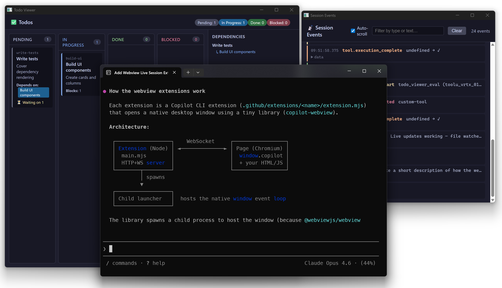

# Copilot CLI Webview Creator

**Give your coding agent a custom UI.** This is an experimental Copilot CLI plugin that teaches the agent how to author extensions for itself that can display arbitrary web UI.

Use this to:

 - Enable the agent to create architecture diagrams, visualize plans, or explain how other people's PRs work
 - Add interactive UI to the coding agent so you can trigger custom actions in your application (e.g., logging in, loading test data, deploying to staging, etc.)
 - Keep track of what the agent is doing

## Install

```
/plugin install SteveSandersonMS/copilot-webview-creator
```

Then just ask Copilot to build an extension with a UI. Examples:

> Use webview creator skill to create an extension that opens a dashboard window showing my open PRs.

> /copilot-webview-creator Create an extension that shows arbitrary web content with a tool set_html you can use to set content into it

> Now draw an architecture diagram of PR #1234 in the webview



## License

MIT

